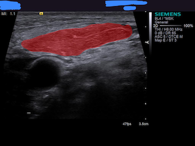
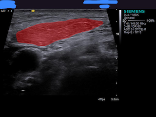

# Hands-on Medical image segmentation using U-net architecture implemented by deep learning framework Keras

The architecture was inspired by [U-Net: Convolutional Networks for Biomedical Image Segmentation](http://lmb.informatik.uni-freiburg.de/people/ronneber/u-net/).

## Overview
#### Notice: 
#### &nbsp;&nbsp;&nbsp;&nbsp;I can not open my data for the moment, since that contains patiences' privacy problem. I can show my code which works nice for your reference only.
-----
### Data
We crop the raw images to size of 256*256 as the input to Unet.

* Train: 350 preproccessed images in data/train

* Validation: 35 images in data/validation

* Test: 20 images in data/test/

You should place pictures (should be square) in directory: "data/train" to train.

### Data augmentation

Using ImageDataGenerator in keras.preprocessing.image to do data augmentation. We augmented the train dataset to 2000 images in total for nice segmentation result.

### Model

This deep neural network is implemented with Keras functional API, which makes it extremely easy to experiment with different interesting architectures.

Output from the network is a 256*256 which represents mask that should be learned. Sigmoid activation function
makes sure that mask pixels are in \[0, 1\] range.

### Training
[Important] All images used in taining should be '.tif' format\
The descent model is trained on NVIDIA GTX-1080 8G GPU for 209 epochs, and for the result evalution, We use dice score as our metrics. After 209 epochs, calculated accuracy is about 0.98.

See model.py for detail

---

## How to use

### Dependencies

This tutorial depends on the following libraries:

* Tensorflow-gpu >= 1.9.0
* Keras for 2.2.4

### Run testMyUnet.ipynb

This notebook will load in output pictures from our Unet, then do some post-process then paste back to the original full-scale original pictures and save results. (Perhapes some management for the path if necessary)

### Or run trainMyUnet.ipynb

Also if you are interested in training your own model from scratch, run this notebook and adjust the hyperparameters on your will.\
Input images would be something like this:\
In folder "data/train/image":

In folder "data/train/label":

### Results

Use the trained model to do segmentation on test images, the result is statisfactory.

## About Keras

Keras is a minimalist, highly modular neural networks library, written in Python and capable of running on top of either TensorFlow or Theano. It was developed with a focus on enabling fast experimentation. Being able to go from idea to result with the least possible delay is key to doing good research.

Use Keras if you need a deep learning library that:

allows for easy and fast prototyping (through total modularity, minimalism, and extensibility).
supports both convolutional networks and recurrent networks, as well as combinations of the two.
supports arbitrary connectivity schemes (including multi-input and multi-output training).
runs seamlessly on CPU and GPU.
Read the documentation [Keras.io](http://keras.io/)

Keras is compatible with: Python 2.7-3.5.
